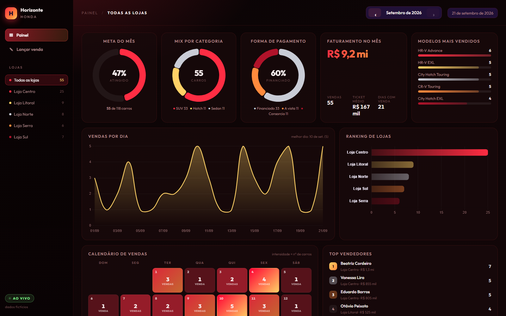
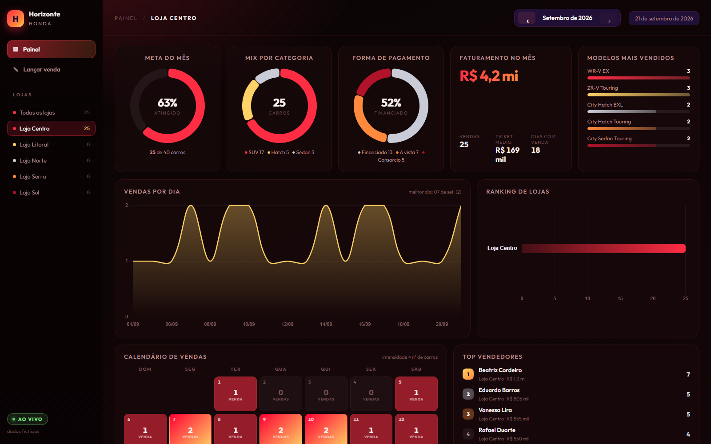
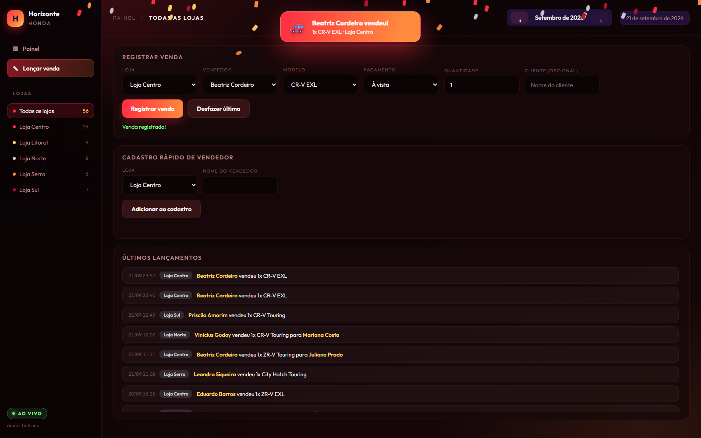

# Painel de Vendas — Grupo Horizonte Honda (dados fictícios)

Painel analítico de vendas para uma rede fictícia de concessionárias Honda: metas por loja, ranking de vendedores, mix de modelos, forma de pagamento e um calendário de vendas por dia — com lançamento de venda em tempo real.



**[▶ Abrir a demo online](https://diegosantiago1.github.io/Portifolio/projetos/painel-vendas/)**: roda no navegador, com os dados fictícios. O back-end completo (PostgreSQL e API) roda localmente, veja [Como rodar localmente](#como-rodar-localmente) e [Demo online](#demo-online).

## Contexto

Este projeto nasceu de um sistema real que uso no meu trabalho como Analista Administrativo de Vendas numa concessionária Honda: uma planilha com Google Apps Script que a equipe usava para acompanhar vendas do dia e meta do mês. Ele fazia o trabalho, mas tinha limitações que valia a pena resolver como projeto de estudo — e eu não podia simplesmente publicar o original, porque continha nomes reais de funcionários e metas comerciais confidenciais da empresa.

Por isso, reconstruí o problema do zero: mesma necessidade de negócio (acompanhar vendas, metas e desempenho por loja e por vendedor), arquitetura nova, tecnologias que estou estudando para migrar de TI administrativo para Dados, e **dado 100% fictício** — nenhuma informação real da empresa entra neste repositório (veja [Dados fictícios, de propósito](#dados-fictícios-de-propósito)).

## O problema que o painel resolve

Uma rede com várias lojas precisa responder, todo dia, perguntas como:

- Quanto vendemos hoje, essa semana, esse mês — no total e por loja?
- Cada loja está batendo a própria meta mensal?
- Quem são os vendedores que mais venderam, e em qual loja?
- Que modelo e que categoria (Sedan/Hatch/SUV) estão vendendo mais?
- Financiamento, à vista ou consórcio — o que os clientes estão escolhendo?
- Teve dia fraco ou dia forte esse mês? Qual foi o melhor dia?

O sistema original respondia isso numa única tela, mas sem histórico consultável (só "hoje" e "semana"), sem filtro por loja individual e com o cálculo de meta rodando dentro do próprio Apps Script, sem banco de dados de verdade por trás.

## O que mudou em relação ao sistema original

| | Original (Apps Script) | Este projeto |
|---|---|---|
| Armazenamento | Planilha Google Sheets | PostgreSQL, modelado em tabelas normalizadas |
| Backend | Google Apps Script (`doGet`/`doPost`) | API REST em Node.js + TypeScript + Express |
| Consultas analíticas | Calculadas em JavaScript, na planilha | Agregadas em SQL (`SUM`/`GROUP BY`/views), no banco |
| Gerente da venda | Selecionado à mão, podia divergir do vendedor | Derivado automaticamente do vendedor (`vendedores.gerente_id`) |
| Filtro por loja | Não existia | Cada loja pode ser vista isoladamente, com os mesmos KPIs, gráficos e calendário |
| Histórico | Só "hoje" e semana corrente | Qualquer mês, navegável |
| Fuso horário | Implícito, sem tratamento | `TIMESTAMPTZ` + `ALTER DATABASE ... SET timezone` (ver [Decisões técnicas](#decisões-técnicas)) |
| Execução | Amarrado à conta Google/planilha | `docker compose up` + `npm run dev`, roda em qualquer máquina |

## Arquitetura

```
Python (gera dados fictícios)
        │
        ▼
PostgreSQL 16 (Docker)  ──►  API REST (Node.js + TypeScript + Express)  ──►  Front-end (HTML/CSS/JS + Chart.js)
   tabelas + views              agregações em SQL, sem ORM                    consome só a API, sem lib de UI
```

- **Banco de dados**: PostgreSQL 16 rodando em container Docker, com o schema (`db/schema.sql`) aplicado automaticamente na primeira subida via `docker-entrypoint-initdb.d`.
- **Geração de dados**: script Python (`scripts/gerar_dados_ficticios.py`) que povoa o banco com lojas, equipe comercial, catálogo de modelos e ~60 dias de histórico de vendas fictício, mas estatisticamente plausível (mais vendas em dias úteis e perto do fechamento do mês).
- **API**: Node.js + TypeScript + Express 5, com SQL escrito à mão via `pg` (sem ORM — decisão deliberada, ver abaixo). Sobe também os arquivos estáticos do front-end, então em desenvolvimento é um único processo (`npm run dev`).
- **Front-end**: HTML/CSS/JavaScript puro consumindo a API via `fetch`, com Chart.js para os gráficos. Sem framework — o tamanho da tela não justificava React/Vue aqui, e evitar essa dependência manteve o foco do projeto em backend, SQL e modelagem de dados.

## Modelo de dados

```
lojas ──┬── gerentes ──┬── vendedores ──── vendas ──── modelos
        │              │
        └──────────────┴── (uma loja tem 1+ gerentes e 1+ vendedores)
```

- `lojas`, `gerentes`, `vendedores`, `modelos`, `vendas` — tabelas normalizadas, com chaves estrangeiras e `CHECK` constraints (ex.: `quantidade > 0`, `forma_pagamento IN (...)`).
- `vendas.valor_unitario` é copiado do preço do modelo **no momento da venda** — histórico não muda se o preço do modelo for atualizado depois, igual a um sistema de vendas de verdade.
- **Integridade no próprio banco**, não só na API: chaves estrangeiras compostas impedem venda com vendedor (ou gerente) de outra loja, e um índice único impede dois vendedores com o mesmo nome na mesma loja. Quem insere direto no banco, sem passar pela API, também é barrado.
- Duas views (`vw_vendas`, `vw_metas_mes_atual`) juntam as tabelas uma vez só. A API usa `vw_vendas` no feed de últimos lançamentos; as duas ficam prontas para uma ferramenta de BI (como o Power BI) conectar direto, sem reescrever os `JOIN`s.
- Índices em `criado_em`, `(loja_id, criado_em)` e `vendedor_id`, as colunas mais filtradas e agrupadas pelo painel.

Schema completo: [`db/schema.sql`](db/schema.sql).

## Decisões técnicas

**Sem ORM.** A API usa `pg` com SQL escrito à mão em vez de Prisma/TypeORM. É uma escolha deliberada de aprendizado: o objetivo deste projeto era treinar SQL de verdade (`JOIN`, `GROUP BY`, `date_trunc`, views, subqueries com `COALESCE`/`NULLIF`), não abstraí-lo atrás de um ORM.

**Fuso horário do banco.** O Postgres roda em UTC por padrão dentro do container. Sem corrigir isso, uma venda lançada às 21h em Recife (horário local) cairia depois da meia-noite em UTC — e qualquer relatório por dia ("vendas de hoje", calendário) classificaria essa venda no dia seguinte. A correção é uma linha no schema: `ALTER DATABASE vendas_honda SET timezone TO 'America/Recife'`. Encontrei esse bug testando manualmente (uma venda lançada à noite aparecia no dia errado no calendário) e corrigi na fonte, no banco — não maquiando no front-end.

**Gerente derivado do vendedor, não escolhido à mão.** No sistema original, era possível selecionar um vendedor de uma loja e um gerente de outra por engano, porque eram dois campos independentes. Aqui, `vendedores.gerente_id` já amarra vendedor ao gerente certo, e a API deriva o gerente automaticamente a partir do vendedor escolhido — elimina essa classe inteira de erro de digitação, e é um campo a menos para preencher no formulário.

**Agregação no banco, não no navegador.** Toda métrica do painel (KPIs, ranking, série por dia, mix por categoria) é um `SUM`/`GROUP BY` em SQL, na rota `/api/analytics`. Nenhum cálculo de agregação acontece em JavaScript no cliente. Isso importa porque não escala trazer todas as linhas de venda pela rede para o navegador somar — o Postgres faz isso ordens de magnitude mais rápido, e a resposta da API já vem pronta pra desenhar o gráfico.

**Um endpoint "bootstrap".** `GET /api/bootstrap` devolve de uma vez só o cadastro e os últimos lançamentos (lojas, vendedores, modelos, feed), em vez da tela disparar várias requisições em cascata toda vez que abre. Mantive essa ideia do sistema original porque ela resolvia bem um problema real de latência percebida. Os números do painel vêm de `/api/analytics`.

**Filtro de mês por faixa, não por `date_trunc` na coluna.** `WHERE criado_em >= início_do_mês AND criado_em < início_do_mês_seguinte` deixa o Postgres usar o índice em `criado_em`; `date_trunc('month', criado_em) = ...` aplica uma função na coluna e obriga a ler a tabela inteira. Medi num banco de teste com 1 milhão de linhas: 314 ms com `date_trunc` contra 29 ms com a faixa. Com as ~190 linhas do projeto a diferença não aparece, mas é o tipo de detalhe que decide se a consulta escala.

**Validação e erros.** Toda entrada é validada na borda: corpo que não é JSON, tipos errados, ids fora do intervalo do `INT` e nomes longos demais respondem 400 (nunca 500), e vendedor repetido responde 409. O banco continua sendo a última barreira, então as regras de integridade não dependem da API estar certa. O `/api/health` consulta o banco (responde 503 se ele cair) e o pool de conexões trata o evento `error`, então a API sobrevive a uma queda do Postgres e volta sozinha quando ele volta.

**XSS.** Nomes de cliente, vendedor, loja e modelo passam por uma função de escape antes de entrar no HTML. Encontrei o problema testando: um `` digitado no campo "Cliente" executava como código no painel de quem abrisse a tela. O teste que reproduz isso roda contra a API real e contra a demo.

**"Desfazer" só apaga o que você lançou.** A versão inicial removia "a última venda do banco", que com dois usuários poderia ser a de outra pessoa. Agora o painel guarda o id da venda lançada na própria sessão e a API remove por id (`DELETE /api/vendas/:id`). Não há autenticação (é um protótipo de portfólio), então isso evita o acidente, mas não impede quem chama a API de propósito.

**Porta do banco só em `127.0.0.1`.** O Docker publicaria o Postgres em todas as interfaces da máquina, alcançável por qualquer um na mesma rede Wi-Fi com a senha padrão de desenvolvimento.

**minmax(0, 1fr) nas grids CSS.** Bug real encontrado testando com navegador automatizado (Playwright): depois de vários ciclos de trocar de loja/mês e o Chart.js recriar um gráfico no mesmo `<canvas>`, uma tela de 1366px (resolução comum de notebook) passava a ter rolagem horizontal. Causa: uma track de CSS Grid definida como `1fr` nunca encolhe abaixo do conteúdo mínimo de dentro dela — e um canvas tem largura fixa em pixel. A correção (`minmax(0, 1fr)` nas três grids do painel) é o fix padrão desse problema clássico do CSS Grid.

## Dados fictícios, de propósito

Todo o histórico de vendas é gerado por [`scripts/gerar_dados_ficticios.py`](scripts/gerar_dados_ficticios.py): 5 lojas, 5 gerentes, 18 vendedores, 17 modelos Honda (nomes públicos, preços ilustrativos) e ~60 dias de vendas com sazonalidade plausível (mais movimento em dias úteis e perto do fim do mês). Nomes de pessoas, cidades e metas são inventados — nenhum dado real da concessionária onde trabalho está neste repositório. `random.seed(42)` fixa o sorteio, e o histórico é montado para trás a partir de uma data-âncora: sem argumento a âncora é o dia em que o script roda (o painel sempre tem movimento "hoje"), e com `--ate AAAA-MM-DD` a mesma data gera sempre exatamente os mesmos dados (conferi por hash das linhas). O script é idempotente (`TRUNCATE ... RESTART IDENTITY CASCADE`), então pode ser rodado quantas vezes precisar. Vale ser honesto: o sorteio é uniforme (qualquer modelo tem a mesma chance, qualquer vendedor da loja também), então os dados servem para o painel, mas não escondem padrões a "descobrir" numa análise.

## Como rodar localmente

Pré-requisitos: Docker Desktop, Node.js 24+, Python 3.13+.

```bash
# 1. Banco de dados (Postgres em container, schema aplicado automaticamente)
docker compose up -d

# 2. Variáveis de ambiente
cp .env.example .env

# 3. Gerar os dados fictícios
python -m venv .venv
.venv/Scripts/activate            # Linux/Mac: source .venv/bin/activate
pip install -r requirements.txt
python scripts/gerar_dados_ficticios.py            # ou --ate 2026-09-23 para dados sempre idênticos

# 4. API + front-end (um único processo, com hot-reload)
cd server
npm install
npm run dev
```

Acesse **http://localhost:3333**.

**Testes** (com o banco no ar e os dados carregados): `cd server && npm test`. São 36 testes de integração com o runner nativo do Node (validação das rotas, ciclo lançar/desfazer, parâmetros do analytics e as regras de integridade do banco). Não deixam resíduo nos dados.

**Já tinha o banco criado antes das regras de integridade?** O `schema.sql` só roda em volume vazio. Aplique a migração: `docker exec -i honda-vendas-db psql -U honda -d vendas_honda -v ON_ERROR_STOP=1 < db/migracoes/001_integridade_e_indices.sql` (roda numa transação: falha inteira ou nada).

## Demo online

O GitHub Pages só serve arquivos estáticos, então a demo não usa o Node nem o PostgreSQL. O mesmo front-end (`web/`) roda com uma camada que responde às chamadas `/api/` dentro do próprio navegador, sobre os dados fictícios exportados do banco.

```bash
python scripts/exportar_demo.py   # banco -> demo/demo-data.json
node scripts/build_demo.mjs       # gera demo/dist: front-end + camada de API
```

- `demo/demo-api.js` refaz em JavaScript as consultas que na versão real são SQL (`SUM`/`GROUP BY`). Comparei as respostas dela com as da API real (8 consultas por mês e por loja, o cadastro e os últimos lançamentos) e são idênticas.
- O histórico é reancorado no dia em que a página abre, então "hoje" sempre tem movimento.
- Lançamentos feitos na demo ficam só na memória da página: recarregar volta ao estado inicial.

## Funcionalidades

- **Painel geral e por loja**: clicar numa loja na barra lateral filtra KPIs, gráficos, calendário e ranking só para ela.
- **Navegação por mês**: setas no topo percorrem o histórico; não é possível avançar além do mês atual.
- **Calendário de vendas**: intensidade de cor proporcional ao volume do dia, com o dia de hoje destacado.
- **Lançamento de venda**: formulário com validação de loja/vendedor/modelo e feedback animado mostrando quem vendeu e qual carro. "Desfazer" remove só o lançamento da própria sessão.
- **Cadastro rápido de vendedor** numa loja já existente.
- Atualização automática a cada 30 segundos.




## Tecnologias

`PostgreSQL 16` · `Docker` · `Python` (`SQLAlchemy`, `psycopg`) · `Node.js` · `TypeScript` · `Express 5` · `node:test` · `Chart.js` · `HTML/CSS/JavaScript`

## Próximos passos possíveis

- Rodar os testes em CI (GitHub Actions, com um Postgres de serviço).
- Camada de análise sobre um histórico maior e com padrões próprios (SQL com CTEs e window functions, notebook em Pandas).
- Exportar relatório mensal em PDF/Excel.
- Autenticação, caso o painel saia de um protótipo de portfólio para um uso multiusuário real.

---

Projeto de estudo, parte da minha transição de Administrativo/Logística para Dados. Mais contexto no [meu GitHub](https://github.com/DiegoSantiago1) e [portfólio](https://diegosantiago1.github.io/Portifolio/).
